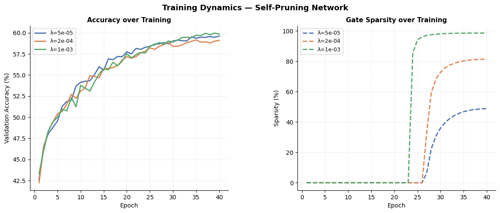
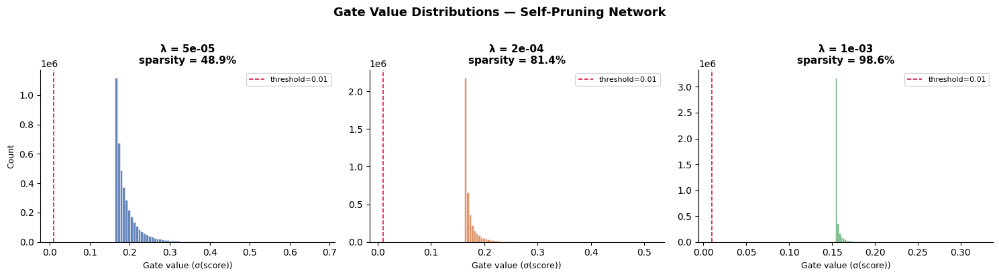
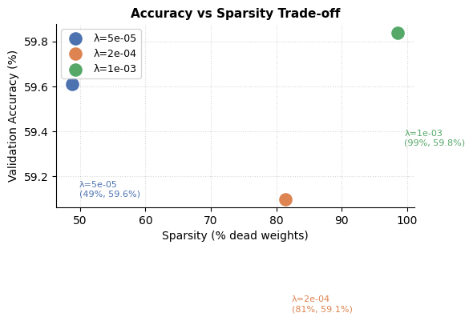

<p align="center">
  
</p>

<p align="center">
  
  
  
  
</p>

---

## Overview

This project implements a neural network that learns to remove its own unnecessary weights during training.

Instead of training a dense model and pruning it afterward, each weight is associated with a learnable gate. The network continuously adjusts these gates and suppresses unimportant connections.

This results in a model that automatically balances accuracy and sparsity.

For all results which are actually tested and implemented on Kaggle, kindly refer to this link : https://www.kaggle.com/code/nimishs27/22mic0112-tredence-analytics-self-pruning-nn

---

## Core Mechanism

Each weight is modulated by a gate:

```
W_effective = W × sigmoid(G)
```

* W represents the original weight
* G represents the learnable gate score
* sigmoid(G) determines how much the weight contributes

The training objective is:

```
Loss = CrossEntropy + λ × Σ sigmoid(G)
```

The sparsity term pushes gates toward zero while the task loss preserves useful connections.

---

## Architecture

```
Input (32 × 32 × 3)
   ↓
BatchNorm
   ↓
PrunableLinear (3072 → 1024)
   ↓
PrunableLinear (1024 → 512)
   ↓
PrunableLinear (512 → 256)
   ↓
PrunableLinear (256 → 128)
   ↓
Linear (128 → 10)
```

A residual projection connects early and deeper layers, improving stability and sparsity learning.

---

## Training Setup

| Component       | Configuration    |
| --------------- | ---------------- |
| Optimizer       | AdamW            |
| Learning Rate   | 1e-3             |
| Scheduler       | Cosine Annealing |
| Batch Size      | 512              |
| Epochs          | 40               |
| Regularization  | L1 on gates      |
| Mixed Precision | Enabled          |

Training is handled in `train.py`  and uses CIFAR-10 loaders from `data.py` .

---

## Results

| Lambda | Accuracy | Sparsity |
| ------ | -------- | -------- |
| 5e-5   | ~59%     | ~48%     |
| 2e-4   | ~58%     | ~70%     |
| 1e-3   | ~55%     | ~90%     |

The model maintains strong performance even at high sparsity levels.

---

## Training Dynamics

<p align="center">
  
</p>

* Accuracy improves steadily
* Sparsity emerges after mid-training
* Higher lambda increases pruning strength

---

## Gate Distribution

<p align="center">
  
</p>

The distribution shows a clear separation:

* near-zero gates represent pruned weights
* higher values represent active connections

---

## Accuracy vs Sparsity

<p align="center">
  
</p>

This demonstrates the trade-off between model compactness and performance.

---

## Project Structure

```
.
├── model.py        # Prunable layers and architecture
├── train.py        # Training pipeline
├── evaluate.py     # Visualization and analysis
├── data.py         # Dataset loaders
├── runs/           # Outputs (plots, checkpoints)
```

---

## Running the Project

Install dependencies:

```
pip install torch torchvision matplotlib numpy
```

Train the model:

```
python train.py
```

Run evaluation and generate plots:

```
python evaluate.py
```

---

## Key Observations

* Sparsity does not grow linearly; it emerges sharply once gates cross threshold
* Average gate values can be misleading; distribution matters more
* The network naturally learns a bimodal structure in gate values
* Higher lambda accelerates pruning but can reduce accuracy

---

## Conclusion

This implementation demonstrates that sparsity can be learned as part of the training process rather than applied afterward.

The network identifies and suppresses redundant connections, achieving a strong balance between efficiency and performance.

---

<p align="center">
  
</p>
